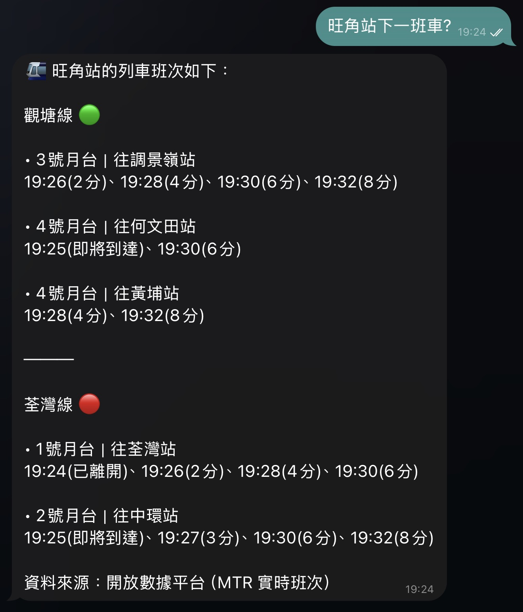
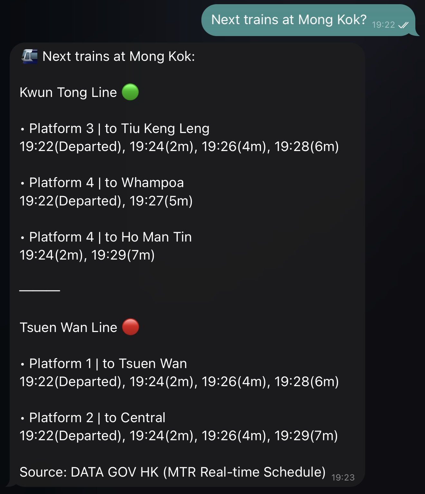

# Hong Kong MTR Next-Train ETA Skill for AI Agents | 港鐵實時到站預報

[](https://opensource.org/licenses/MIT)
[](https://www.python.org/downloads/)
[](https://github.com/openclaw/openclaw)
[](https://clawhub.ai/tomfong/hk-mtr-next-train)
[](https://github.com/tomfong/hk-mtr-next-train-skill)

> 🚈 **Real-time Hong Kong MTR next-train ETA lookup** | **港鐵實時到站時間查詢**

Author: [Tom FONG](https://github.com/tomfong) (with Usagi - Tom's OpenClaw Agent) 

## Overview

A skill package for **OpenClaw** and compatible AI agents that provides **real-time arrival times for all of the MTR lines** in **Hong Kong**, with fuzzy station matching and bilingual output (zh-HK/en).


| Feature | Description |
| ------- | ----------- |
| 🚈 Real-time ETA | Live MTR train arrival times from DATA.GOV.HK |
| 🚇 Multi-line | Supports all 10 MTR lines including Airport Express |
| 🎯 Fuzzy Matching | Smart station name matching (e.g., "旺角" matches "Mong Kok") |
| ⚡ Token & Resources Friendly | Lightweight local CSV caching minimizes API calls; concise, data-first output optimized for AI context windows |
| 🌐 Bilingual Output | Traditional Chinese and English support |

## Installation

### Installation Methods

#### From ClawHub (Recommended)
```bash
clawhub install hk-mtr-next-train
```

#### From GitHub Source
```bash
clawhub install https://github.com/tomfong/hk-mtr-next-train-skill --path hk-mtr-next-train --as hk-mtr-next-train
```

### ⚡ **First-Time Setup (Recommended)**

**You are recommended to run the following command once before first use:**

```bash
python3 {skill_dir}/hk-mtr-next-train/scripts/sync_mtr_stations.py
```

**Example**

```bash
python3 ~/.openclaw/workspace/skills/hk-mtr-next-train/scripts/sync_mtr_stations.py
```

**What this does:**
- Downloads MTR stations data from DATA.GOV.HK
- Builds local CSV file (mtr_lines_and_stations.csv) for fast queries

**Why is this needed?**
- Provides **offline station lookup** capability
- Enables **fuzzy location matching** without API calls
- **Speeds up subsequent queries** significantly

> `{skill_dir}` = skill installation directory, e.g. `~/.openclaw/workspace/skills/hk-mtr-next-train`

## Documentation

### This README contains complete documentation including:
- ✅ Installation instructions
- ✅ Usage examples
- ✅ Feature overview
- ✅ Technical details
- ✅ Changelog

### Additional Technical References:
- **[Technical Reference](hk-mtr-next-train/README.md)** - Technical architecture and script usage
- **[SKILL.md](hk-mtr-next-train/SKILL.md)** - AI agent specification and implementation details
- **[Scripts Directory](hk-mtr-next-train/scripts/)** - Python scripts source code

## Search Optimization

This skill is optimized for **natural language queries** with **fuzzy matching** capabilities:

**Search by:**
- **Station Names**: "Central", "金鐘", "旺角"
- **Line Name**: "港島線", "東鐵線", "Tuen Ma Line"

## Usage Examples

### Natural Language Queries | 自然語言查詢
**Just ask in Cantonese, English, or mixed:**

**Examples:**
- "紅磡站下一班列車？"
- "Next trains at Disneyland Resort？"
- "將軍澳站往康城嘅下一班車?"

### Direct Command Usage
The skill supports direct commands for query:

```bash
exec python3 {skill_dr}/hk-mtr-next-train/scripts/mtr_eta.py {STATION_NAME} {LINE_NAME(optional)} {LANG(optional)} {TO_STATION(optional)}
```

### Sample Output
```
🚈 會展站的列車班次如下：

東鐵線 🩵

• 1號月台｜往羅湖站
19:19(即將到達)、19:23(5分)、19:25(7分)

• 1號月台｜往落馬洲站
19:21(3分)

• 2號月台｜往金鐘站
19:20(2分)、19:23(5分)、19:25(7分)、19:28(10分)

資料來源：開放數據平台
```

<table>
  <tr>
    <td></td>
    <td></td>
  </tr>
</table>

## Changelog

### v1.0.0 (2026-03-18)
- Initial release 

## Technical Details

### Data Sync

```bash
python3 {skill_dir}/hk-mtr-next-train/scripts/sync_mtr_stations.py
```

**Example**

```bash
python3 ~/.openclaw/workspace/skills/hk-mtr-next-train/scripts/sync_mtr_stations.py
```

### Requirements
| Requirement | Notes                |
| ----------- | -------------------- |
| Python 3.x  | Main script runtime  |
| `curl`      | API calls            |

### Data Source
MTR next-train data from APIs of [DATA.GOV.HK](https://data.gov.hk) (開放數據平台)
  
## Contributing

* Sponsor the project.
  
  [](https://github.com/sponsors/tomfong?frequency=one-time)
  [](https://www.buymeacoffee.com/tomfong)

* Star the project.

  [](https://github.com/tomfong/hk-mtr-next-train-skill/stargazers)

* Open issues to report bugs or share any new ideas.

  [](https://github.com/tomfong/hk-mtr-next-train-skill/issues)

## License

MIT License - See [LICENSE](LICENSE) for details.

---

_SIMPLE DEV · SIMPLER WORLD_
